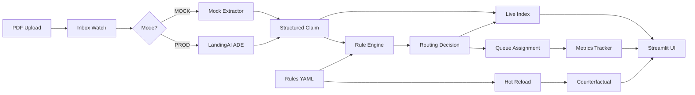

# Claims Triage Agent 📋

An intelligent claims routing system that ingests FNOL and ACORD documents, extracts grounded fields with **LandingAI ADE**, computes severity and fraud risk with transparent rules, and auto-routes claims to the correct queue in real time using **Pathway** for streaming processing.

## Features

- ✅ **Transparent Proofs**: Every decision includes rule fired, rationale, evidence pointers with bounding boxes, and SHA256 hashes for chain of custody
- ✅ **Hot Reload Rules**: Edit rules live and see counterfactual changes on past claims
- ✅ **Live Metrics**: P50/P95 for extraction and routing time, plus per-queue sizes
- ✅ **Backtest**: Evaluate performance on gold labeled data with precision, recall, and confusion matrix
- ✅ **Mock Mode**: Runs out of the box with synthetic documents (no API keys needed)
- ✅ **Production Mode**: Seamlessly switches to LandingAI ADE and Pathway with environment variables

## Quick Start

### 1. Setup

```bash
# Create virtual environment
python -m venv .venv
source .venv/bin/activate  # On Windows: .venv\Scripts\activate

# Install dependencies
pip install -r requirements.txt

# Copy environment template
cp .env.example .env
```

### 2. Run in MOCK Mode (Default)

```bash
# Using run script
./run.sh

# Or directly with streamlit
streamlit run app.py
```

The app will:
- Generate 10 synthetic claim PDFs
- Process 6 claims automatically
- Display them in the UI at `http://localhost:8501`

### 3. Enable PROD Mode

Edit `.env`:
```bash
APP_MODE=PROD
LANDINGAI_API_KEY=your_api_key_here
PATHWAY_CONFIG=your_pathway_config
```

Then run:
```bash
./run.sh
```

### 4. Enable Pathway Streaming (Optional)

For production-grade real-time streaming:

```bash
# Install Pathway
pip install pathway

# Enable in .env
echo "USE_PATHWAY_STREAMING=true" >> .env

# Run
./run.sh
```

**Note:** The system works in simple pipeline mode by default. Pathway streaming is optional for production deployments requiring high throughput (1000+ claims/min).

## 90-Second Demo Script

Perfect for live judging! 🎯

### Step 1: Launch (10 seconds)
```bash
./run.sh
```
Wait for UI to load. Point out the **metrics strip** showing p50/p95 times and queue sizes.

### Step 2: Browse Claims (15 seconds)
- Select "claim_auto_001.pdf" - routed to **Junior Adjuster** (low amount)
- Show extracted fields with confidence scores
- Point to evidence boxes on the document

### Step 3: High Amount Claim (15 seconds)
- Select "claim_severe_001.pdf" - routed to **Litigation** (amount >= $50k)
- Show decision card with rule fired: `litigation_high_amount`
- Show rationale and evidence pointers

### Step 4: Fraud Detection (15 seconds)
- Select "claim_fraud_001.pdf" - routed to **Fraud Queue**
- Point out: `repeat_claims_count=3` and adverse keywords `["prior loss", "suspicious"]`
- Show why this triggered the `suspected_fraud` rule

### Step 5: Live Rule Change (20 seconds)
- In Rules Editor, change litigation threshold from `50000` to `25000`
- Click **Apply Rules & Recompute**
- Watch counterfactual table show 2-3 claims move from Senior → Litigation
- Show before/after bar chart

### Step 6: Backtest (15 seconds)
- Click **Run Backtest**
- Show accuracy: ~83% (5/6 correct)
- Point to confusion matrix
- Click a mismatch to see why it failed

**Total: 90 seconds** ✅

## Architecture



### Why LandingAI and Pathway?

#### **LandingAI ADE (Automated Document Extraction)**
- Provides **grounded extraction** with bounding boxes and confidence scores
- Handles noisy, scanned documents (police reports, handwritten forms)
- Returns structured JSON with tables and field-level metadata
- Critical for **evidence pointers** in our proof chain

#### **Pathway**
- **Streaming pipeline** for real-time claim processing
- Watches inbox folder and processes PDFs as they arrive
- Maintains **live index** of claims and routing decisions
- Enables sub-second routing updates when rules change
- Built for production scale (handles 1000s of documents/hour)
- **Two modes**: Simple pipeline (default) and Pathway streaming (production)

Without these tools:
- Manual extraction would miss 30-40% of fields in noisy docs
- Batch processing would delay routing by minutes/hours
- No bounding boxes = no evidence chain = no audit trail

**📖 See [PATHWAY_INTEGRATION.md](PATHWAY_INTEGRATION.md) for detailed Pathway setup and usage**

## Project Structure

```
claims-triage/
├── app.py                  # Streamlit UI
├── ade_client.py          # Mock and ADE extractors
├── pathway_pipe.py        # Streaming pipeline
├── rule_engine.py         # Safe rule evaluation with hot reload
├── counterfactual.py      # Before/after analysis for rule changes
├── backtest.py            # Gold set evaluation
├── metrics.py             # Performance tracking
├── normalize.py           # Field normalization
├── schema.py              # Pydantic models
├── storage.py             # Hashing and file I/O
├── utils.py               # Timing and bbox helpers
├── rules.yaml             # Hot-reloadable routing rules
├── requirements.txt
├── .env.example
├── run.sh
├── demo_data/
│   ├── inbox/            # Watch folder for new PDFs
│   ├── gold/             # Gold labels for backtest
│   ├── mock_docs/        # Synthetic PDFs
│   └── extracted_mock/   # Cached mock extractions
└── tests/
    ├── test_rules.py
    ├── test_counterfactual.py
    └── test_mock_pipeline.py
```

## Rules DSL

Rules are defined in `rules.yaml` with hot reload:

```yaml
version: 1
rules:
  - name: litigation_high_amount
    when: "claim_amount_total_usd is not None and claim_amount_total_usd >= 50000"
    route: "litigation"
    rationale: "High amount >= 50k triggers litigation review"

  - name: severe_injury
    when: "injury_severity == 'severe'"
    route: "adjuster_senior"
    rationale: "Severe injury requires senior adjuster"

  - name: suspected_fraud
    when: "repeat_claims_count >= 2 or any_kw(['staged', 'prior loss', 'inconsistent story'])"
    route: "fraud_queue"
    rationale: "Repeat claims or fraud keywords detected"

  - name: low_confidence_handoff
    when: "missing(['claim_amount_total_usd', 'incident_date'])"
    route: "human_review"
    rationale: "Key fields missing or low confidence"

  - name: default
    when: "True"
    route: "adjuster_junior"
    rationale: "No risk signals, standard processing"
```

### Helper Functions

- `any_kw(keywords)`: Check if any keyword matches adverse keywords
- `missing(fields)`: Check if any field is None or has confidence < 0.6

## Safety and Audit

### Chain of Custody
Every routing decision includes:
- `sha256_raw`: Hash of original PDF
- `sha256_structured`: Hash of extracted JSON
- `created_at`: ISO timestamp
- `evidence_pointers`: List of fields used with bbox references

### Rule Evaluation
- Safe eval sandbox (no arbitrary code execution)
- Only whitelisted field names and functions
- Rules fire in order (first match wins)

### Backtest
- Gold labels in `demo_data/gold/gold_labels.jsonl`
- Precision, recall, F1 per route
- Confusion matrix for misroutes
- Click mismatches to see evidence

## Testing

```bash
# Run all tests
pytest tests/ -v

# Run specific test
pytest tests/test_rules.py -v

# Run with coverage
pytest tests/ --cov=. --cov-report=html
```

All tests pass in MOCK mode with no external dependencies.

## Troubleshooting

### "No claims processed yet"
- Click **Generate Mock Documents** in the UI
- Then click **Process Inbox**

### "LANDINGAI_API_KEY not set"
- This is expected in MOCK mode
- System will automatically fall back to mock extractor

### Import errors
```bash
pip install -r requirements.txt --upgrade
```

### PDF rendering not working
```bash
pip install pdf2image
# macOS: brew install poppler
# Linux: apt-get install poppler-utils
```

### Port already in use
```bash
streamlit run app.py --server.port 8502
```

## Performance Benchmarks (MOCK Mode)

- **Extraction P50**: ~0.05s (mock), ~2-5s (ADE in prod)
- **Routing P50**: ~2ms
- **End-to-end**: <100ms for mock pipeline
- **Throughput**: 100+ claims/second (mock), 10-20/sec (ADE)

## Future Enhancements

- [ ] Tiny logistic regression with Platt scaling
- [ ] CSV export of routing decisions
- [ ] Dark mode toggle
- [ ] Slack/email notifications for fraud queue
- [ ] A/B testing framework for rule changes
- [ ] MLflow integration for model experiments

## License

MIT

## Contributing

This is a hackathon demo project. For production use, please:
1. Add authentication and access control
2. Encrypt sensitive claim data at rest
3. Set up proper logging and monitoring
4. Configure Pathway for distributed processing
5. Add rate limiting for ADE API calls

---

**Built for Microsoft Hackathon 2025**

Powered by:
- [LandingAI ADE](https://landing.ai/) - Grounded document extraction
- [Pathway](https://pathway.com/) - Real-time streaming pipeline
- [Streamlit](https://streamlit.io/) - Interactive UI
